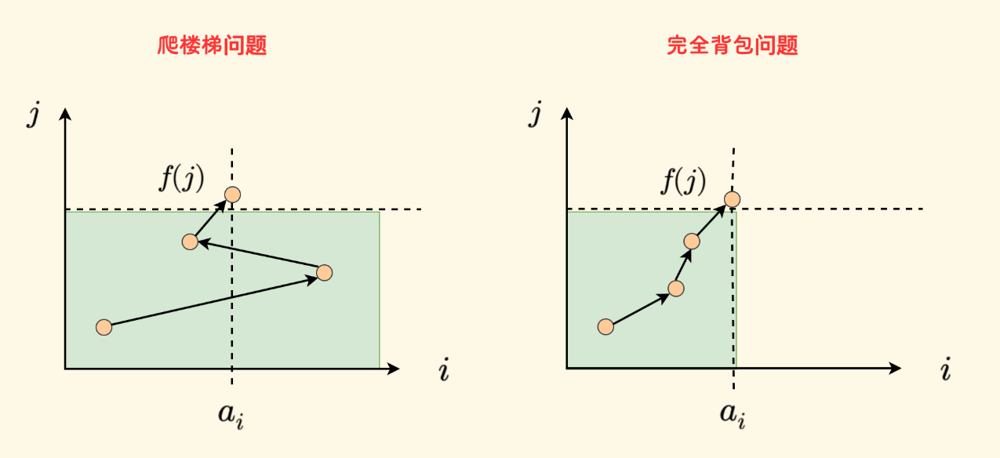

> 很晚才认识到自己很菜，算法和做数学题一样，需要归纳+记忆

## 参考资料

[分享｜如何科学刷题？](https://leetcode.cn/discuss/post/3141566/ru-he-ke-xue-shua-ti-by-endlesscheng-q3yd/)


## 题单（Hot）

```plaintext
分类目录
一、树
二、回溯
三、动态规划
四、链表
五、深度优先搜索
六、单调/栈/队列
七、数组
八、字符串
九、位运算
十、数学
十一、图
十二、二分查找


一、树
94. 二叉树的中序遍历（递归，迭代，栈，列表，哈希表，莫里斯遍历）✅
96. 不同的二叉搜索树（递归，动态规划）✅
98. 验证二叉搜索树（递归，迭代）✅
101. 对称二叉树（递归，迭代）✅
102. 二叉树的层序遍历（递归，迭代）✅
103. 二叉树的锯齿形层序遍历（递归，迭代）✅
104. 二叉树的最大深度（递归，迭代）✅
105. 从前序与中序遍历序列构造二叉树（递归，迭代）✅
110. 平衡二叉树（递归）✅
112. 路径总和（递归，迭代）✅
113. 路径总和 II（递归，回溯，迭代）✅
114. 二叉树展开为链表（迭代）✅
124. 二叉树中的最大路径和（递归）✅✅
129. 求根节点到叶节点数字之和（递归，迭代）✅
144. 二叉树的前序遍历（递归，迭代）✅
145. 二叉树的后序遍历（递归，迭代）✅
199. 二叉树的右视图（迭代）✅
226. 翻转二叉树（递归，迭代）✅
236. 二叉树的最近公共祖先（递归）✅
297. 二叉树的序列化与反序列化（递归，迭代）
437. 路径总和 III（递归）✅
538. 把二叉搜索树转换为累加树（递归）✅
543. 二叉树的直径（递归）✅
589. N叉树的前序遍历（递归，迭代）✅
617. 合并二叉树（递归，迭代）✅
662. 二叉树最大宽度（递归，迭代）✅
968. 监控二叉树（递归）（Hard） hold


二、回溯
17. 电话号码的字母组合
37. 解数独
39. 组合总和 ✅
40. 组合总和 II
46. 全排列 ✅
47. 全排列 II
51. N 皇后
77. 组合✅
78. 子集
79. 单词搜索 ✅
90. 子集 II
93. 复原 IP 地址
131. 分割回文串
216. 组合总和 III
301. 删除无效的括号
491. 递增子序列

698. 划分为k个相等的子集


三、动态规划

背包问题
    01背包
        416. 分割等和子集（01背包）✅
        494. 目标和 ✅
        474. 一和零（多维01背包）✅
        1049. 最后一块石头的重量 II（01背包，类似416）✅

5. 最长回文子串
10. 正则表达式匹配
22. 括号生成 ✅
32. 最长有效括号
42. 接雨水
53. 最大子数组和
55. 跳跃游戏
62. 不同路径
64. 最小路径和
70. 爬楼梯
72. 编辑距离
96. 不同的二叉搜索树
115. 不同的子序列
121. 买卖股票的最佳时机
122. 买卖股票的最佳时机 II
123. 买卖股票的最佳时机 III
139. 单词拆分
152. 乘积最大子数组
188. 买卖股票的最佳时机 IV
198. 打家劫舍
221. 最大正方形
279. 完全平方数
300. 最长上升子序列
309. 最佳买卖股票时机含冷冻期
312. 戳气球
322. 零钱兑换（完全背包）✅吃力
337. 打家劫舍 III
392. 判断子序列
494. 目标和
509. 斐波那契数
516. 最长回文子序列
518. 零钱兑换 II
583. 两个字符串的删除操作
647. 回文子串
674. 最长连续递增序列
712. 两个字符串的最小ASCII删除和
714. 买卖股票的最佳时机含手续费
718. 最长重复子数组
1035. 不相交的线
1143. 最长公共子序列


四、链表
2. 两数相加（迭代模拟）
19. 删除链表的倒数第 N 个结点（递归，快慢指针，栈，计数）
21. 合并两个有序链表（递归，迭代）
23. 合并K个升序链表（顺序合并，分治合并）
24. 两两交换链表中的节点（递归，迭代）
25. K 个一组翻转链表（多指针）
82. 删除排序链表中的重复元素 II（递归，双指针）
83. 删除排序链表中的重复元素
92. 反转链表 II（多指针）✅
138. 复制带随机指针的链表（递归，迭代，哈希表）
141. 环形链表（快慢指针，列表，哈希表）
142. 环形链表 II（快慢指针，列表，哈希表）
143. 重排链表（双指针，快慢指针，递归）
146. LRU 缓存（双向链表，哈希表）
148. 排序链表（归并排序，优先级队列，列表）
160. 相交链表(双指针，列表)
203. 移除链表元素（迭代，递归）
206. 反转链表(迭代，递归，建链表，栈，插入)
234. 回文链表（快慢指针，递归，列表）
707. 设计链表（单链表，双链表）


五、深度优先搜索
79. 单词搜索✅
130. 被围绕的区域
200. 岛屿数量
463. 岛屿的周长
695. 岛屿的最大面积
1020. 飞地的数量
1254. 统计封闭岛屿的数目
1905. 统计子岛屿


六、单调栈/队列
84. 柱状图中最大的矩形（单调递增栈）✅
85. 最大矩形（单调递增栈，暴力，动态规划）（hard）✅
155. 最小栈✅
232. 用栈实现队列
316. 去除重复字母（单调递增栈）✅
402. 移掉 K 位数字（单调递增栈）
407. 接雨水 II（优先级队列）
496. 下一个更大元素 I（单调递减栈）
503. 下一个更大元素 II（单调递减栈）
739. 每日温度（单调递减栈）✅
901. 股票价格跨度（单调递减栈）✅
1081. 不同字符的最小子序列（单调递增栈）


七、数组
1. 两数之和（哈希表）✅
4. 寻找两个有序数组的中位数（排序，双指针，二分查找）
11. 盛最多水的容器（双指针）
15. 三数之和（三指针）✅
31. 下一个排列（置换） ✅
41. 缺失的第一个正数（置换，排序，集合）✅
48. 旋转图像（置换）✅
54. 螺旋矩阵（四指针）✅
56. 合并区间（二维数组排序）✅
59. 螺旋矩阵 II（四指针）✅
75. 颜色分类（双指针+遍历）✅
88. 合并两个有序数组（排序，双指针）✅
128. 最长连续序列（集合，排序）
136. 只出现一次的数字（哈希表，列表，位运算）✅
169. 多数元素（投票抵消）
215. 数组中的第K个最大元素（快速选择——三路优化重复元素场景，堆排序）✅
238. 除自身以外数组的乘积（前缀和）
239. 滑动窗口最大值（单调递减双端队列）
240. 搜索二维矩阵 II（二分查找）
283. 移动零（双指针）
287. 寻找重复数（哈希表，快慢指针，二分查找，位运算）
303. 区域和检索 - 数组不可变（前缀和）
304. 二维区域和检索 - 矩阵不可变（前缀和）
347. 前 K 个高频元素（快速排序，堆排序，优先级队列）
406. 根据身高重建队列（二维数组排序）
448. 找到所有数组中消失的数字（计数，集合，置换）
560. 和为 K 的子数组（前缀和，哈希表）
581. 最短无序连续子数组（排序，双指针）
621. 任务调度器（桶填充）
867. 转置矩阵（置换）


八、字符串
3. 无重复字符的最长子串（滑动窗口）
8. 字符串转换整数 (atoi)
14. 最长公共前缀（横向比较，纵向比较）
20. 有效的括号（字符替换，哈希表）
32. 最长有效括号（栈，贪心，计数，动态规划）
43. 字符串相乘（模拟相乘，位置规律）
76. 最小覆盖子串（双指针，滑动窗口）
151. 颠倒字符串中的单词（分割反转，双指针，双端队列）
165. 比较版本号（双指针，字符串分割）
208. 实现 Trie (前缀树)
224. 基本计算器（双栈）
227. 基本计算器 II（双栈，哈希表）
394. 字符串解码（栈）
415. 字符串相加（模拟相加）
438. 找到字符串中所有字母异位词（滑动窗口，双指针）
468. 验证IP地址（分割校验）


九、位运算
287. 寻找重复数
338. 比特位计数
461. 汉明距离


十、数学
470. 用 Rand7() 实现 Rand10()（拒绝采样）


十一、图
207. 课程表（拓扑排序）
399. 除法求值（并查集）

十二、二分查找
4. 寻找两个有序数组的中位数（排序，双指针，二分查找）
29. 两数相除（二分查找）
33. 搜索旋转排序数组（二分查找）✅
34. 在排序数组中查找元素的第一个和最后一个位置（二分查找）
81. 搜索旋转排序数组 II（二分查找）
69. x 的平方根（二分查找）
153. 寻找旋转排序数组中的最小值（二分查找）
154. 寻找旋转排序数组中的最小值 II（二分查找）
162. 寻找峰值（二分查找）✅单调性都可以使用二分
240. 搜索二维矩阵 II（二分查找）
287. 寻找重复数（哈希表，快慢指针，二分查找，位运算）
704. 二分查找 ✅

```


## 前置概念问题

#### 递归、回溯、记忆化搜索、DFS的区别？

递归：调用自身，解决问题的子问题

记忆化搜索：最优解。递归的优化版本（缓存），用于**避免重复计算重叠子问题**，用于优化

回溯：穷举所有方案。强调尝试+回退。递归基础上，采用了优化手段，比如：剪枝、回退

DFS：遍历结构，树/图


## 单调栈

### 零、概念

2025年06月06日，我在网络上没有找到单调栈的实际定义

那么，当讨论“递增”或“递减”时，是以 栈顶 >>> 栈底 还是 栈底 >>> 栈顶？


灵神这个说法挺直观的


在常看的宝藏博客中也是如此定义：[春水煎茶 · 王超的个人博客|单调栈的性质 和 题目总结](https://writings.sh/post/monotonic-stack)


后续都以此定义（bottom >>> top）单调趋势，避免纠结


### 一、基础

```
 739. 每日温度 模板题✅
 1475. 商品折扣后的最终价格 非暴力做法✅
 496. 下一个更大元素 I✅
 503. 下一个更大元素 II✅
 901. 股票价格跨度✅
 853. 车队 hold
```


### 二、矩阵

```
 84. 柱状图中最大的矩形（矩形性质，单调栈性质很关键，）✅
 1793. 好子数组的最大分数【hard】
 85. 最大矩形【hard】✅
 1504. 统计全 1 子矩形
 42. 接雨水 （横向计算长*宽，单调递减栈找下一个更大值）✅
 755. 倒水（会员题）
```

矩阵题反复做84、85

> 建议阅读：[单调栈的性质 和 题目总结](https://writings.sh/post/monotonic-stack#%E6%9F%B1%E7%8A%B6%E5%9B%BE%E4%B8%AD%E6%9C%80%E5%A4%A7%E7%9A%84%E7%9F%A9%E5%BD%A2)


## 动态规划

题单：[分享丨【算法题单】动态规划（入门/背包/划分/状态机/区间/状压/数位/树形/优化）](https://leetcode.cn/discuss/post/3581838/fen-xiang-gun-ti-dan-dong-tai-gui-hua-ru-007o/)

思路：递归 >>> 迭代（二维dp） >>> 降维（一维dp）


### 一、入门dp

#### 爬楼梯

组合总和为什么不是完全背包问题？而是爬楼梯？



从动态规划的角度来看，二者的 阶段划分 和 转移方式 不同：

- 完全背包问题，是以物品 𝑎<sub>𝑖</sub> 来划分阶段，再考虑每个体积 𝑗 的转移。   

- 这个爬楼梯问题，是以目标 𝑗 来划分阶段，使用每个𝑎<sub>𝑖</sub> 来转移。

转载请注明原文链接: https://writings.sh/post/knapsack#%E7%BB%84%E5%90%88%E6%80%BB%E5%92%8C

> [!IMPORTANT]
>
> 测试


### 二、网格图dp


### 三、背包

非竞赛，只需要把01背包和完全背包搞搞清楚


#### 01背包

> **“选一次，从后遍；可重复，从前扫”**

- 01 背包 ➜ 倒序容量

```java
// 给定容量为 target，每个物品只能选一次
for (int i = 0; i < n; i++) { // 遍历每个物品
    for (int j = target; j >= weight[i]; j--) { // 一维滚动数组优化，需要避免修改上层的状态，所以此处倒序
        dp[j] = Math.max(dp[j], dp[j - weight[i]] + value[i]);
    }
}
```


#### 完全背包

组合数


完全背包 ➜ 正序容量（允许多次使用）

```java
// 每个物品可以选无限次
for (int j = 0; j <= target; j++) { // 遍历容量
    for (int i = 0; i < n; i++) { // 每种物品都尝试
        if (j >= weight[i]) {
            dp[j] = Math.max(dp[j], dp[j - weight[i]] + value[i]);
        }
    }
}
```


## 二分查找

红蓝，循环不变量
