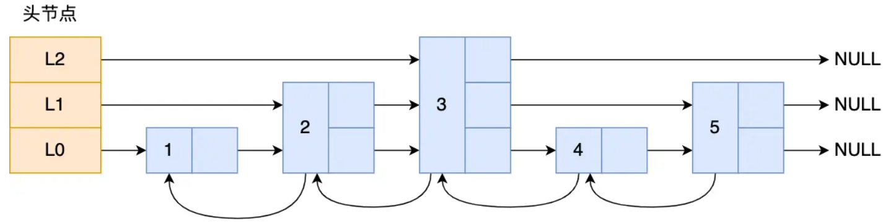

> 整理源于小林coding
> https://www.xiaolincoding.com/redis/base/redis_interview.html

## 一、认识Redis

#### 有哪些使用场景？

缓存、分布式锁、消息队列、布隆过滤器等等

#### 与Memcached有什么区别？

相同点：

- 内存数据库（性能高），通常用作缓存
- 过期策略

区别：

- Memcached只有key-value

- Redis有丰富的数据结构，还支持持久化、发布订阅、Lua脚本、哨兵集群模式等等

## 二、数据格式

#### Redis有哪些数据格式？对应什么使用场景？

Redis有五种基础数据类型：

1. String 类型的应用场景:缓存对象、常规计数、分布式锁、共享 session 信息等。

2. List 类型的应用场景:消息队列(但是有两个问题:
   1.生产者需要自行实现全局唯- ID;
   2.不能以消费组形式消费数据)等。

3. Hash 类型:缓存对象、用户信息、购物车等。
4. Set 类型:聚合计算(并集、交集、差集)场景，比如点赞、共同关注、抽奖活动等。
5. Zset 类型:排序场景，比如排行榜、电话和姓名排序等。

Redis 后续版本又支持四种数据类型，它们的应用场景如下

1. BitMap(2.2 版新增):二值状态统计的场景，比如签到、判断用户登陆状态、连续签到用户总数等:
2. HyperLogLog(2.8 版新增):海量数据基数统计的场景，比如百万级网页 UV 计数等;
3. GEO(3.2 版新增):存储地理位置信息的场景，比如滴滴叫车;
4. Stream(5.0 版新增):消息队列，相比于基于 List 类型实现的消息队列，有这两个特有的特性:自动生成全局唯一消息ID，支持以消费组形式消费数据。

#### 底层数据结构有哪些？Zset

Zset由跳表+哈希表实现，好处是高效支持范围查询和单点查询

#### 什么是跳表？

查询的时间复杂度为O(logN)

## 三、线程模型

#### Redis是单线程的吗？

通常说的单线程，指的是处理读/写请求的整个过程（**网络IO+命令的执行**）是由一个线程完成的

Redis服务本身不是单线程的，还有三个后台线程

1. 关闭文件
2. AOF 刷盘
3. 释放内存

#### Redis的单线程是如何工作的？

**Reactor 模型** + **epoll（Linux）/ kqueue（Mac）**

Redis 的事件循环 `ae_epoll.c` 注册读/写事件，然后轮询触发。

每次循环处理如下几个阶段：

1. 处理定时任务（如过期 key）
2. 处理网络读事件（接收请求）
3. 处理命令（执行业务逻辑）
4. 处理网络写事件（返回结果）

#### Redis为什么单线程还那么快？

| 原因                 | 说明                                                 |
| -------------------- | ---------------------------------------------------- |
| IO 多路复用（epoll） | 单线程监听所有客户端请求，事件驱动，避免线程切换开销 |
| 操作都是内存级别     | 数据全在内存，读写速度极快，避免了磁盘瓶颈           |
| 高效的数据结构       | 单个 Redis 命令执行时间极短，O(1)/O(logN) 为主       |
| 无锁竞争             | 单线程避免了线程加锁、并发控制，提高执行效率         |

#### Redis 6.0 为什么引入多线程？

Redis 6.0 版本支持的 I/O  多线程特性，默认情况下 I/O 多线程只针对发送响应数据（write client socket），并不会以多线程的方式处理读请求（read client socket）。

要想开启多线程处理客户端读请求，就需要把  Redis.conf  配置文件中的 io-threads-do-reads 配置项设为 yes。

## 四、持久化

#### 如何实现数据不丢失？有哪些方式？

重启/宕机时，内存数据会丢失，所以需要持久化到磁盘

Redis有三种持久化方式：

1. RDB快照：某一时刻的数据，二进制写入磁盘
2. AOF日志：命令追加写到磁盘文件
3. 混合持久化：Redis 4.0 集成上面两种方式

#### RDB是如何实现的？

#### AOF是如何实现的？

#### 哪种更好？为什么需要混合模式？

## 五、集群

#### Redis如何实现高可用？

> 主从、哨兵、分片集群

**哨兵模型**相比主从，增加了哨兵节点，监控主从服务的健康状态，提供自动的故障转移功能

缓存数据量特别大时考虑使用**分片集群**，分散读写压力

## 六、过期与淘汰

## 七、缓存设计

## 八、实战问题

#### redis除了缓存，还有什么使用场景？

消息队列

分布式锁

